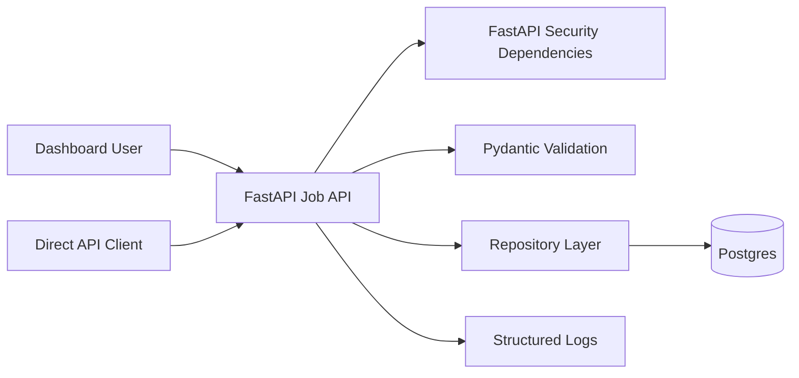
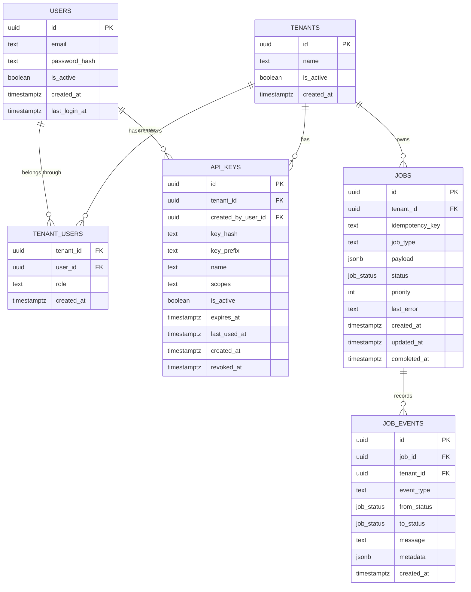

# Basic Job API Server

This document outlines a minimal job API server for the take-home project. It describes the simpler baseline version of the system: authenticated tenants can submit jobs, list jobs, inspect job status, and read job history while the system persists data durably and exposes enough structure to evolve into the full distributed task queue platform.

The baseline server is intentionally smaller than the full queue implementation. It focuses on clear API design, persistent storage, validation, authentication, status visibility, and reproducible local setup.

## Goals

- Provide a clean REST API for managing jobs.
- Persist users, tenants, API keys, jobs, and job history in Postgres.
- Authenticate API requests.
- Validate request and response schemas.
- Support basic job lifecycle states.
- Support idempotent job creation.
- Expose simple status and listing endpoints.
- Provide basic observability through logs and health checks.
- Keep the implementation small and easy to run locally.

## Final Technology Choices

- **API framework:** FastAPI
- **Database:** Postgres
- **ORM/query layer:** SQLAlchemy or SQLModel
- **Validation:** Pydantic
- **Authentication:** Email/password dashboard login plus tenant-scoped API keys
- **FastAPI security:** `OAuth2PasswordBearer`, `OAuth2PasswordRequestForm`, and `APIKeyHeader`
- **Migrations:** Alembic
- **Local runtime:** Docker Compose
- **Testing:** Pytest

## High-Level Architecture



## Responsibilities

### Job API

The API owns the client-facing behavior.

It does:

- authenticate requests
- validate request bodies
- create job records
- return existing jobs for duplicate idempotency keys
- list jobs by tenant
- fetch job details
- record job history events
- expose health checks

It does not:

- execute jobs
- lease jobs to workers
- retry failed jobs
- maintain a DLQ
- enforce worker concurrency quotas
- stream real-time updates
- mutate submitted jobs through public update/delete endpoints

Those behaviors belong to the full distributed queue implementation.

### Repository Layer

Repositories own database access and keep SQLAlchemy query details out of route handlers and authentication dependencies.

The current baseline includes:

- `app/repositories/users.py` for registration, login lookup, and user-to-tenant membership lookup
- `app/repositories/api_keys.py` for API key creation, listing, lookup, revocation, and usage timestamps
- `app/repositories/jobs.py` for job lookup, creation, listing, and event history

Route modules remain responsible for HTTP concerns such as authentication dependencies, request validation, status codes, and response serialization.

## Data Model



## Database Schema

```sql
CREATE EXTENSION IF NOT EXISTS pgcrypto;

CREATE TYPE job_status AS ENUM (
  'PENDING',
  'RUNNING',
  'SUCCEEDED',
  'FAILED',
  'CANCELLED'
);

CREATE TABLE tenants (
  id UUID PRIMARY KEY DEFAULT gen_random_uuid(),
  name TEXT NOT NULL,
  is_active BOOLEAN NOT NULL DEFAULT true,
  created_at TIMESTAMPTZ NOT NULL DEFAULT now()
);

CREATE TABLE users (
  id UUID PRIMARY KEY DEFAULT gen_random_uuid(),
  email TEXT NOT NULL UNIQUE,
  password_hash TEXT NOT NULL,
  is_active BOOLEAN NOT NULL DEFAULT true,
  created_at TIMESTAMPTZ NOT NULL DEFAULT now(),
  last_login_at TIMESTAMPTZ
);

CREATE TABLE tenant_users (
  tenant_id UUID NOT NULL REFERENCES tenants(id) ON DELETE CASCADE,
  user_id UUID NOT NULL REFERENCES users(id) ON DELETE CASCADE,
  role TEXT NOT NULL DEFAULT 'owner',
  created_at TIMESTAMPTZ NOT NULL DEFAULT now(),
  PRIMARY KEY (tenant_id, user_id)
);

CREATE TABLE api_keys (
  id UUID PRIMARY KEY DEFAULT gen_random_uuid(),
  tenant_id UUID NOT NULL REFERENCES tenants(id) ON DELETE CASCADE,
  created_by_user_id UUID REFERENCES users(id) ON DELETE SET NULL,
  key_hash TEXT NOT NULL UNIQUE,
  key_prefix TEXT NOT NULL,
  name TEXT NOT NULL,
  scopes TEXT[] NOT NULL DEFAULT ARRAY['jobs:read', 'jobs:write'],
  is_active BOOLEAN NOT NULL DEFAULT true,
  expires_at TIMESTAMPTZ,
  last_used_at TIMESTAMPTZ,
  created_at TIMESTAMPTZ NOT NULL DEFAULT now(),
  revoked_at TIMESTAMPTZ
);

CREATE TABLE jobs (
  id UUID PRIMARY KEY DEFAULT gen_random_uuid(),
  tenant_id UUID NOT NULL REFERENCES tenants(id) ON DELETE CASCADE,
  idempotency_key TEXT NOT NULL,
  job_type TEXT NOT NULL,
  payload JSONB NOT NULL,
  status job_status NOT NULL DEFAULT 'PENDING',
  priority INT NOT NULL DEFAULT 0,
  last_error TEXT,
  created_at TIMESTAMPTZ NOT NULL DEFAULT now(),
  updated_at TIMESTAMPTZ NOT NULL DEFAULT now(),
  completed_at TIMESTAMPTZ,
  UNIQUE (tenant_id, idempotency_key)
);

CREATE TABLE job_events (
  id UUID PRIMARY KEY DEFAULT gen_random_uuid(),
  job_id UUID NOT NULL REFERENCES jobs(id) ON DELETE CASCADE,
  tenant_id UUID NOT NULL REFERENCES tenants(id) ON DELETE CASCADE,
  event_type TEXT NOT NULL,
  from_status job_status,
  to_status job_status,
  message TEXT,
  metadata JSONB NOT NULL DEFAULT '{}',
  created_at TIMESTAMPTZ NOT NULL DEFAULT now()
);

CREATE INDEX idx_jobs_tenant_status
ON jobs (tenant_id, status, created_at DESC);

CREATE INDEX idx_jobs_tenant_created
ON jobs (tenant_id, created_at DESC);

CREATE INDEX idx_job_events_job_id
ON job_events (job_id, created_at DESC);
```

## API Endpoints

### `POST /auth/register`

Creates a dashboard user and an initial tenant.

Request:

```json
{
  "email": "admin@acme.com",
  "password": "correct-horse-battery-staple",
  "tenantName": "Acme Corp"
}
```

Response:

```json
{
  "userId": "uuid",
  "tenantId": "uuid",
  "email": "admin@acme.com"
}
```

### `POST /auth/login`

Logs in a dashboard user using FastAPI's `OAuth2PasswordRequestForm` request shape.

Request content type:

```text
application/x-www-form-urlencoded
```

Form fields:

```text
username=admin@acme.com
password=correct-horse-battery-staple
```

Response:

```json
{
  "access_token": "signed-access-token",
  "token_type": "bearer"
}
```

### `GET /auth/me`

Returns the current dashboard user and tenant.

### `POST /api-keys`

Creates a tenant-scoped API key for direct API access. This endpoint requires dashboard user authentication.

Response:

```json
{
  "apiKeyId": "uuid",
  "name": "local curl client",
  "keyPrefix": "tqk_live_ab12",
  "apiKey": "tqk_live_ab12_generated-secret"
}
```

The raw API key is returned only once. The database stores only a hash.

### `GET /api-keys`

Lists API keys for the authenticated user's tenant. Raw key values are never returned.

### `DELETE /api-keys/{api_key_id}`

Revokes an API key.

### `POST /jobs`

Creates a job.

Headers, using one of the authentication options:

```text
Authorization: Bearer signed-access-token
or
X-API-Key: tqk_live_generated-secret
Idempotency-Key: client-generated-key
```

Dashboard requests use `Authorization`. Direct API clients use `X-API-Key`. The server accepts either credential type and derives the tenant from the credential.

Request:

```json
{
  "type": "send_email",
  "payload": {
    "to": "customer@example.com",
    "template": "welcome"
  },
  "priority": 0
}
```

Response:

```json
{
  "jobId": "generated-uuid",
  "status": "PENDING",
  "idempotencyKey": "client-generated-key"
}
```

If the same tenant submits the same idempotency key again, the API returns the existing job.

### `GET /jobs`

Lists jobs for the authenticated tenant.

Query parameters:

```text
status=PENDING|RUNNING|SUCCEEDED|FAILED|CANCELLED
limit=50
```

### `GET /jobs/{job_id}`

Returns one job owned by the authenticated tenant.

### `GET /jobs/{job_id}/events`

Returns status history for a job.

### `GET /health`

Returns service health.

Example response:

```json
{
  "status": "ok",
  "database": "ok"
}
```

## Request Validation

Job creation should enforce:

- `type` is required
- `payload` is required and must be a JSON object
- `priority` is optional and defaults to `0`
- `Idempotency-Key` is required
- request body size is limited

Example Pydantic model:

```python
from pydantic import BaseModel, Field


class JobCreateRequest(BaseModel):
    type: str = Field(min_length=1, max_length=100)
    payload: dict
    priority: int = Field(default=0, ge=0, le=100)
```

## Authentication

The server has two authentication paths.

Dashboard users authenticate with email and password:

1. A user registers with email, password, and tenant name.
2. The server creates a `users` row, hashes the password, creates a `tenants` row, and creates an owner row in `tenant_users`.
3. The user logs in through `POST /auth/login`.
4. The login endpoint uses FastAPI's `OAuth2PasswordRequestForm`.
5. The server verifies the password hash and returns a signed bearer access token.
6. Dashboard requests use FastAPI's `OAuth2PasswordBearer` dependency.

Direct API clients authenticate with tenant-scoped API keys:

1. A logged-in dashboard user creates an API key.
2. The server generates a random key and stores only its hash in `api_keys`.
3. Direct clients send the key in the `X-API-Key` header.
4. The API uses FastAPI's `APIKeyHeader` dependency to resolve the tenant.

Example dashboard request:

```text
Authorization: Bearer signed-access-token
```

Example direct API request:

```text
X-API-Key: tqk_live_generated-secret
```

The client never sends `tenant_id` as trusted input. Tenant isolation comes from the authenticated user session or API key.

## Idempotency

Idempotency is required for `POST /jobs`.

The uniqueness rule is:

```text
UNIQUE (tenant_id, idempotency_key)
```

This means two tenants may use the same idempotency key without conflict, but one tenant cannot create duplicate jobs with the same key.

## Error Handling

Common responses:

```text
400 Bad Request        invalid request body
401 Unauthorized       missing or invalid credentials
403 Forbidden          inactive user, tenant, or API key
404 Not Found          job does not exist for this tenant
409 Conflict           invalid state transition
422 Unprocessable      schema validation error
500 Internal Error     unexpected server failure
```

Errors should use one consistent response shape:

```json
{
  "error": {
    "code": "UNAUTHORIZED",
    "message": "Missing authentication credentials."
  }
}
```

## Observability

The basic job API server should include:

- structured request logs
- request ID propagation
- job creation logs
- authentication failure logs
- health check endpoint

Useful optional metrics:

```text
http_requests_total
http_request_duration_seconds
jobs_created_total
jobs_by_status
```

## Proposed Code Structure

```text
.
├── README.md
├── CRUD_SERVER.md
├── docker-compose.yml
├── pyproject.toml
├── .env.example
├── app
│   ├── __init__.py
│   ├── main.py
│   ├── config.py
│   ├── db.py
│   ├── api
│   │   ├── __init__.py
│   │   ├── auth.py
│   │   ├── api_keys.py
│   │   ├── jobs.py
│   │   └── health.py
│   ├── domain
│   │   ├── __init__.py
│   │   ├── schemas.py
│   │   └── statuses.py
│   ├── repositories
│   │   ├── __init__.py
│   │   ├── users.py
│   │   ├── api_keys.py
│   │   ├── jobs.py
│   │   └── tenants.py
│   └── services
│       ├── __init__.py
│       ├── auth.py
│       ├── password_hashing.py
│       ├── access_tokens.py
│       ├── api_keys.py
│       ├── idempotency.py
│       └── jobs.py
├── migrations
│   └── 001_initial_schema.sql
└── tests
    ├── test_jobs_api.py
    ├── test_auth.py
    ├── test_idempotency.py
    └── test_job_state_transitions.py
```

## Docker Compose

```yaml
services:
  postgres:
    image: postgres:16
    environment:
      POSTGRES_USER: queue
      POSTGRES_PASSWORD: queue
      POSTGRES_DB: task_queue
    ports:
      - "5432:5432"
    volumes:
      - postgres_data:/var/lib/postgresql/data
    healthcheck:
      test: ["CMD-SHELL", "pg_isready -U queue -d task_queue"]
      interval: 5s
      timeout: 5s
      retries: 5

  api:
    build: .
    command: uvicorn app.main:app --host 0.0.0.0 --port 8000
    env_file:
      - .env
    ports:
      - "8000:8000"
    depends_on:
      postgres:
        condition: service_healthy

volumes:
  postgres_data:
```

## Local Commands

Start the server:

```bash
docker compose up --build
```

Register a dashboard user and tenant:

```bash
curl -X POST http://localhost:8000/auth/register \
  -H "Content-Type: application/json" \
  -d '{
    "email": "admin@acme.com",
    "password": "correct-horse-battery-staple",
    "tenantName": "Acme Corp"
  }'
```

Log in:

```bash
curl -X POST http://localhost:8000/auth/login \
  -H "Content-Type: application/x-www-form-urlencoded" \
  -d "username=admin@acme.com&password=correct-horse-battery-staple"
```

Create an API key:

```bash
curl -X POST http://localhost:8000/api-keys \
  -H "Authorization: Bearer signed-access-token" \
  -H "Content-Type: application/json" \
  -d '{"name": "local curl client"}'
```

Submit a job:

```bash
curl -X POST http://localhost:8000/jobs \
  -H "X-API-Key: tqk_live_generated-secret" \
  -H "Idempotency-Key: job-001" \
  -H "Content-Type: application/json" \
  -d '{
    "type": "send_email",
    "payload": {
      "to": "customer@example.com",
      "template": "welcome"
    },
    "priority": 0
  }'
```

List jobs:

```bash
curl http://localhost:8000/jobs \
  -H "X-API-Key: tqk_live_generated-secret"
```

## Testing Strategy

Required tests:

- registration creates a user, tenant, and owner membership
- login rejects invalid credentials and returns an access token for valid credentials
- API key creation returns the raw key once and stores only a hash
- revoked API keys cannot access job APIs
- creating a job persists it
- creating a job requires authentication
- job queries are tenant-scoped
- duplicate idempotency keys return the existing job
- job events are written for create actions
- public job update, cancel, and delete endpoints are not exposed in the baseline API

## What This Leaves Out

This document describes the deliberately small baseline CRUD server, not the
full current queue implementation. The baseline job API server does not include:

- worker execution
- lease management
- retries
- dead-letter queue
- real-time WebSocket updates
- per-tenant concurrency quotas
- submission rate limiting
- autoscaling signals
- full dashboard
- tracing
- production metrics stack

Those features are covered by the full architecture in `ARCHITECTURE.md`.
In the current implementation, autoscaling remains scoped to Prometheus metrics
and documented/manual scaling rather than Kubernetes or cloud autoscaler
automation. `FAILED` and `CANCELLED` also remain reserved states rather than
active worker outcomes.

## Path From Baseline API To Full Queue

The baseline API can evolve into the distributed task queue by adding:

1. `attempts`, `max_attempts`, `run_after`, `lease_expires_at`, and `locked_by` fields to jobs.
2. Worker claim logic using `FOR UPDATE SKIP LOCKED`.
3. Ack, retry, and DLQ behavior.
4. Tenant rate-limit and concurrency quota tables.
5. WebSocket status broadcasting.
6. Prometheus metrics for queue and worker visibility. OpenTelemetry tracing can be added later as production observability work.
7. Dashboard views for pending, running, failed, completed, and dead-lettered jobs through status filters.
